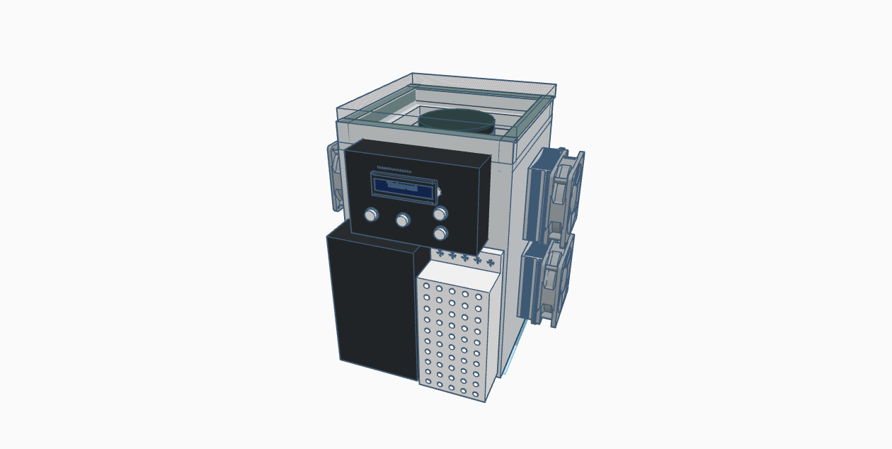
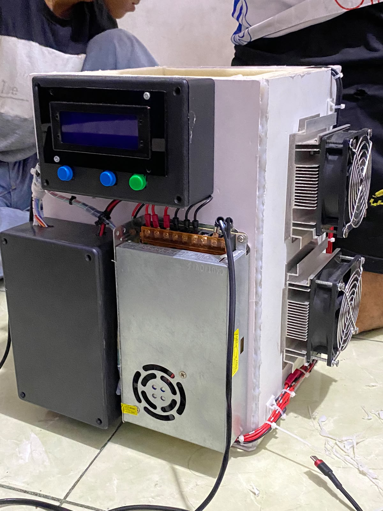
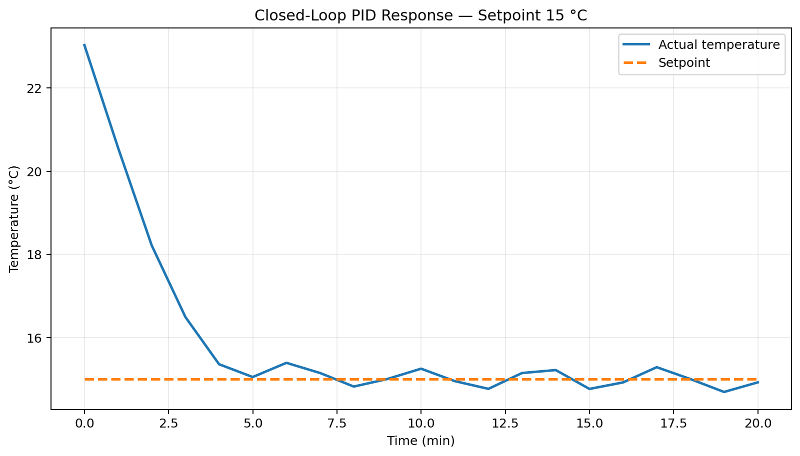
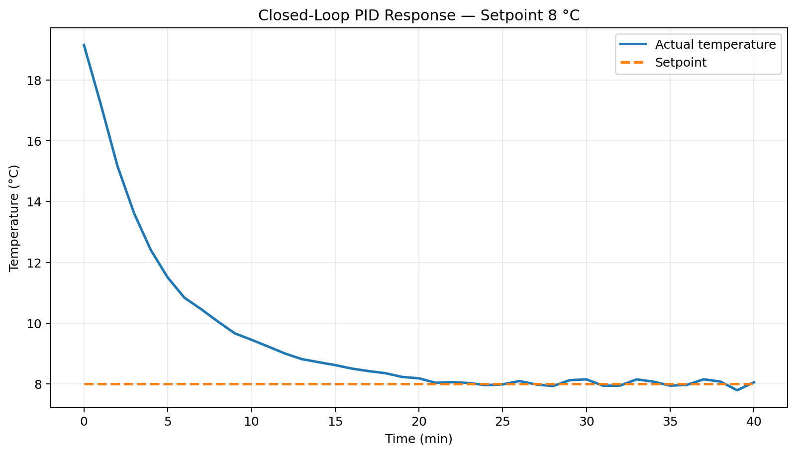
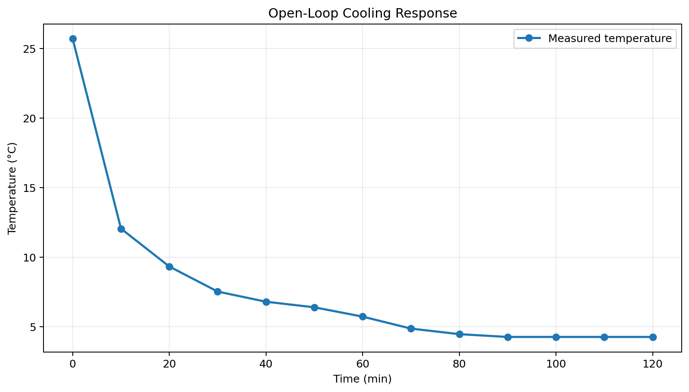

# PID-Controlled Thermoelectric Cooling System for Cold Brew Coffee Extraction

An ESP32-based automatic cooling system developed to regulate the temperature and extraction duration of cold brew coffee using thermoelectric (Peltier) cooling and closed-loop PID control.

This repository contains the embedded firmware, experimental datasets, hardware documentation, an MQTT real-time monitoring dashboard, and selected results from the final-year engineering project.

## Prototype

### 3D Design


### Implemented Prototype


## Project Highlights

- ESP32-based embedded control system
- Closed-loop PID temperature regulation
- TEC1-12706 thermoelectric cooling modules
- PWM power control using BTS7960 drivers
- DS18B20 digital temperature sensing
- RTC DS3231 extraction-time control
- 20×4 I2C LCD user interface
- Push-button menu and buzzer notification
- Open-loop system identification
- Ziegler–Nichols process reaction curve tuning
- Experimental evaluation at 5 °C, 8 °C, and 15 °C
- MQTT telemetry over TLS
- Web-based real-time monitoring dashboard

## Engineering Objective

The system was designed to automatically reduce and maintain the extraction temperature around a selected setpoint while controlling the extraction duration.

Cold brew coffee is used as the application case. The engineering focus of the project is the design and evaluation of the temperature-control system.

## System Architecture

```text
                    +-------------------+
                    |    User Input     |
                    | Push Button / LCD |
                    +---------+---------+
                              |
                              v
+-------------+       +-------+-------+       +-------------+
|  DS18B20    +------>|     ESP32     +------>|   BTS7960   |
| Temperature |       | PID Controller| PWM   | Power Driver|
|   Sensor    |       +-------+-------+       +------+------+ 
+------+------+               |                      |
       ^                       |                      v
       |                       |              +-------+-------+
       |                       |              | TEC1-12706    |
       |                       |              | Peltier       |
       |                       |              +-------+-------+
       |                       |                      |
       +-----------------------+-------------- Cooling Chamber
                               |
                         +-----+------+
                         | RTC DS3231 |
                         +------------+

ESP32 -> Wi-Fi -> HiveMQ Cloud -> Web Dashboard
```

## Hardware

| Component | Function |
|---|---|
| ESP32 | Main controller, PID computation, PWM, user interface and MQTT telemetry |
| DS18B20 | Temperature feedback sensor |
| TEC1-12706 | Thermoelectric cooling actuator |
| BTS7960 | High-current PWM power driver |
| DS3231 | Real-time clock for extraction duration |
| LCD 20×4 I2C | Local process display |
| Push buttons | Menu, setpoint and duration input |
| Buzzer | Audible process notification |
| Heatsink + DC fan | Heat rejection from the hot side of the Peltier modules |
| PU foam | Thermal insulation |
| 12 V power supply | Power source for the cooling system |

## Thesis Baseline: PID Identification and Testing

The thesis baseline used open-loop testing followed by Ziegler–Nichols tuning.

### Open-Loop Identification

The documented thesis parameters were:

| Parameter | Value |
|---|---:|
| Process gain, K | 0.0837 °C/PWM |
| Delay time, L | 0.43 min |
| Time constant, T | 6.47 min |
| Step input | PWM 0 → 255 |

### PID Parameters Used in the Closed-Loop Thesis Tests

| Parameter | Value |
|---|---:|
| Kp | 215.72 |
| Ki | 4.181 |
| Kd | 2782.79 |

## Closed-Loop Performance

| Setpoint | Time to Setpoint Region | Cooling Overshoot | Steady-State Error |
|---:|---:|---:|---:|
| 15 °C | 4.62 min | 0.35 °C | 0.026 °C |
| 8 °C | 19.33 min | 0.27 °C | 0.037 °C |
| 5 °C | 38.63 min | 0.263 °C | 0.026 °C |

### 15 °C Test


### 8 °C Test


### 5 °C Test


## Cooling-System Design Iteration

The prototype was improved after the initial cooling configuration could not reach the required low-temperature setpoints.

The improved configuration used four Peltier modules and PU foam insulation. In the documented cooling test, the system temperature decreased from approximately 25.69 °C to 4.27 °C.



The before/after tests were performed under different overall system and environmental conditions. The improvement should therefore be interpreted as a change in the complete system configuration rather than the isolated effect of increasing the number of Peltier modules.

## DS18B20 Calibration

The thesis documented a linear calibration model:

```text
T_calibrated = 1.0132 × T_raw + 0.5459
```

The reported mean absolute measurement error after calibration was approximately 0.158 °C for the calibration dataset.

## Cold Brew Application Test

A 20-hour extraction test at 5 °C was used as an application-level evaluation.

| Cooling Method | Average pH | Average TDS |
|---|---:|---:|
| PID cooling system | 5.33 | 1043.33 ppm |
| Conventional refrigerator | 5.37 | 1001.00 ppm |

These pH and TDS values are supporting application data and are not, by themselves, a complete measure of sensory coffee quality.

## Current Firmware in This Repository

The included firmware is a later implementation that extends the thesis system with:

- Wi-Fi connectivity
- HiveMQ Cloud MQTT telemetry
- Real-time browser dashboard
- Preset and manual operating modes
- Dual PID parameter sets for different temperature ranges
- Output ramping and basic protection logic
- Local LCD, RTC, push-button and buzzer operation

Because this firmware is a later development version, several calibration and PID constants in the source code differ from the thesis-baseline parameters shown above. The experimental workbooks in `data/` preserve the parameters used for the documented closed-loop thesis tests.

## MQTT Monitoring Dashboard

The web dashboard displays:

- Connection state
- Actual temperature
- Setpoint
- Peltier PWM output
- Remaining extraction time
- Controller status
- Real-time temperature graph
- Real-time PWM graph

Dashboard files:

```text
dashboard/
├── index.html
└── dashboard.html
```

### MQTT Architecture

```text
ESP32
  |
  | MQTT TLS : 8883
  v
HiveMQ Cloud
  ^
  | MQTT over Secure WebSocket : 8884
  |
Web Dashboard
```

The control loop remains on the ESP32. The website is used only for monitoring, so loss of the internet connection does not move the PID computation to the cloud.

## Arduino Libraries

Install:

- OneWire
- DallasTemperature
- RTClib by Adafruit
- LiquidCrystal_I2C
- PubSubClient

## Firmware Configuration

Before uploading the firmware, edit:

```cpp
const char *WIFI_SSID = "ISI_NAMA_WIFI";
const char *WIFI_PASS = "ISI_PASSWORD_WIFI";

const char *MQTT_HOST = "ISI_CLUSTER_HIVEMQ.s1.eu.hivemq.cloud";
const char *MQTT_USER = "ISI_USERNAME_HIVEMQ";
const char *MQTT_PASS = "ISI_PASSWORD_HIVEMQ";
```

The included repository does not contain real Wi-Fi or MQTT credentials.

## Dashboard Configuration

Edit `dashboard/index.html`:

```javascript
const MQTT_HOST = "ISI_CLUSTER_HIVEMQ.s1.eu.hivemq.cloud";
const MQTT_USER = "ISI_USERNAME_HIVEMQ";
const MQTT_PASS = "ISI_PASSWORD_HIVEMQ";
```

The dashboard can be tested locally or deployed as a static website.

For deployment to Vercel, use the contents of the `dashboard/` directory with `index.html` as the entry page.

## Security Notes

The current firmware uses:

```cpp
#define MQTT_TLS_INSECURE true
```

This is suitable only for a controlled demonstration environment. For production use, broker CA certificate validation should be enabled.

MQTT credentials embedded directly in a static HTML dashboard can be viewed in the browser. Production deployments should use a limited read-only account or a backend authentication/proxy architecture.

## Repository Structure

```text
cold-brew-pid-cooling-system/
├── README.md
├── PORTFOLIO_NOTES.md
├── .gitignore
├── firmware/
│   └── cold_brew_pid_mqtt_controller.ino
├── dashboard/
│   ├── index.html
│   └── dashboard.html
├── hardware/
│   └── 3d-design.png
├── images/
│   └── prototype.jpg
├── results/
│   ├── open-loop-response.png
│   ├── closed-loop-5C.png
│   ├── closed-loop-8C.png
│   └── closed-loop-15C.png
├── data/
│   ├── open-loop-TL-analysis.xlsx
│   ├── closed-loop-5C.xlsx
│   ├── closed-loop-8C.xlsx
│   └── closed-loop-15C.xlsx
└── docs/
    ├── thesis-report.pdf
    └── MQTT-dashboard-setup-ID.txt
```

## Experimental Scope

This repository documents an academic prototype. Performance values correspond to the reported prototype and experimental conditions and should not be generalized to different thermal loads, environmental conditions, mechanical constructions, power supplies or Peltier configurations without additional testing.

## Author

**Anugerah Ilahi**  
D-IV Teknik Elektronika  
Jurusan Teknik Elektro  
Politeknik Negeri Padang  
Final Project, 2026
